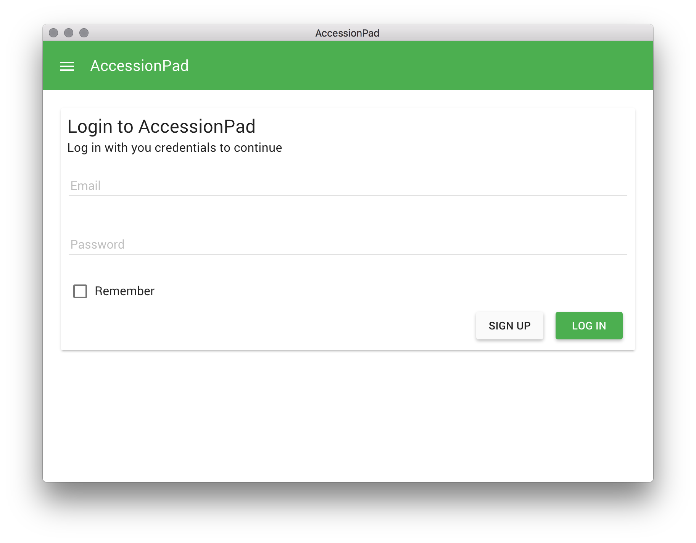
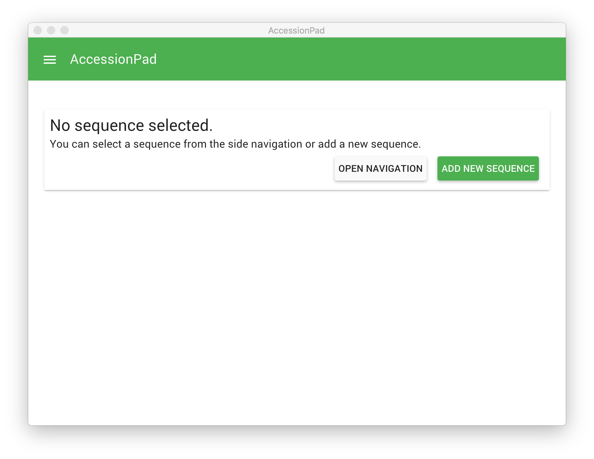
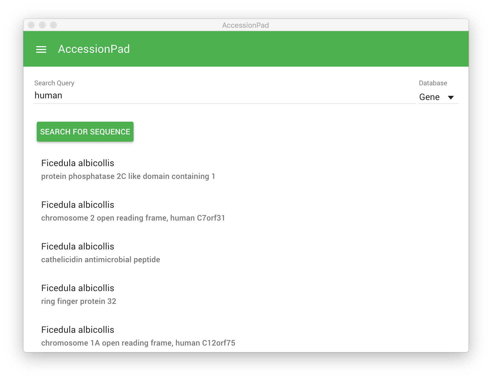
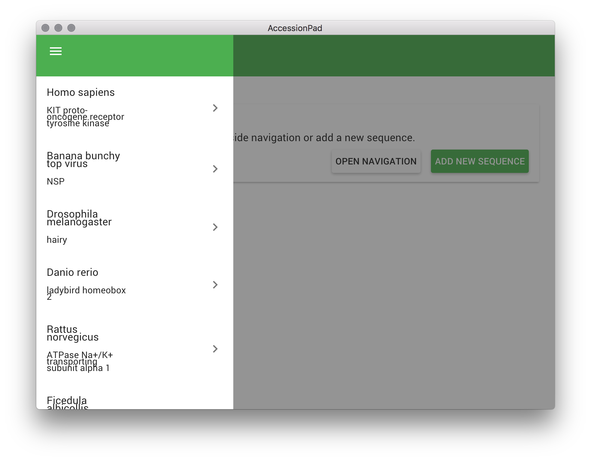
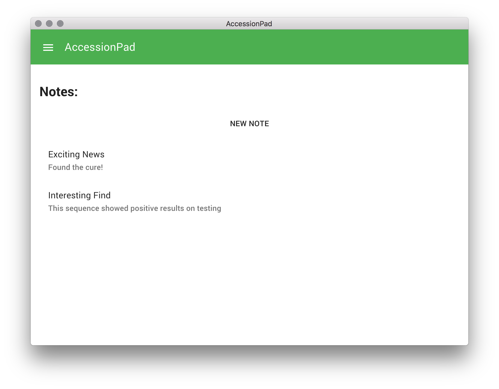
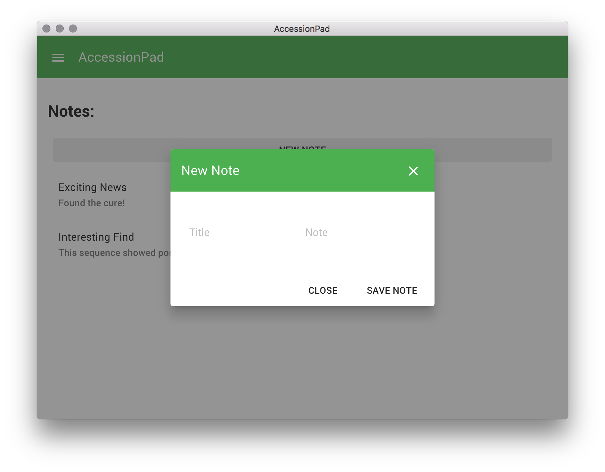

# AccessionPad
## About
### What is AccessionPad?
The inspiration for AccessionPad came from doing light research in the field of Bioinformatics for a class at the University of Louisville.  Throughout my homeworks and programming assignments, I could not find a good way to keep track of the data I was working with for any given task.  More specifically interfacing the NCBI databases for research required me to keep many browser tabs open in order to keep my searches to be able to reference them later.  Thus, the AccessionPad tool was created. This tool allows researchers to login to their account, search for sequences on the NCBI databases, and take notes on them. AccessionPad uses these techniques to communicate with the NCBI API to search and gather details on sequences to present to the user.  AccessionPad uses a firebase NoSQL backend hosted in the cloud to manager user logins and saved data.  Firebase is a NoSQL database that support three-way data binding giving users a sense of real time loading and posting of data.  This data binding could also allow multiple researchers to see another’s work in real time like Google Documents.


### What is AccessionPad built on?
The AccessionPad tool is built on the Electron platform in order to build a cross platform application that can run on any of the major operating systems.  Electron is an open source platform made by Github on Javascript.
The graphical user interface and logic of the application is built with AngularJS by Google.  AngularJS is a Javascript framework built to easily make “single page” applications for modern internet browsers.  AngularJS was chosen for this project because of the HTML extensibility AngularJS supplies.  AngularJS extends HTML in order make extremely responsive, expressive, and readable code.  Other, similar solutions like AngularJS try to deal with the downfalls of the static nature of HTML by either abstracting out HTML or replacing it all together.  The problem with these alternatives is that most browsers and other platforms are built to render HTML exclusively so there would be a many issues to overcome.  Instead of this method, AngularJS extends the HTML language and uses a special syntax to inject dynamic HTML into static HTML at runtime.  This dynamic HTML allows developers to create things like lists of undefined length that was previously very difficult, much easier to create.  Now that these things are much easier to make developers can focus more on creating amazing applications.

## Installation
### Requirements
- Install [Node.js](https://nodejs.org/en/download/)
- Install the [Electron commandline tool](https://github.com/electron-userland/electron-prebuilt)

### Building and running the tool
- cd to the project directory
- Run `npm install` to install node dependencies
- Run 'bower install` to install bower dependencies
- Run `electron .` to run the program

## User Interface
### Login
The login screen allows the user to either create an account or login with an existing account.



### No sequences
If the user has no sequence selected or no sequences in their account they will be prompted to add a new one:


### search
When selecting a new sequence the user queries the NCBI database and selects the desired sequence.


### Navigation
The application uses a side navigation to organize the sequences:


### Notes
The user selects an item from the navigation and is shown their notes on that sequence:


### New Note
The user can add new notes by clicking `New Note`


## Database query
This is a sample query for interfacing with the NCBI API:
```
$http.get("http://eutils.ncbi.nlm.nih.gov/entrez/eutils/esearch.fcgi?db=" + $scope.search.database + "&term=" + $scope.search.query.replace(" ", "+"))
                .then(function (success) {
                    var json = x2js.xml_str2json(success.data);
                    $scope.IdList = json.eSearchResult.IdList.Id;
                    console.log(json);
                }, function (error) {
                    console.log(error);
                });
```

## Future Additions
Since the application already receives all the data regarding a sequence from the eutilities API, the application could easily be modified to show the user those data entries in the GUI.  There could also be an addition of making this application modular by allowing other developers to create modules for their specific needs.  
